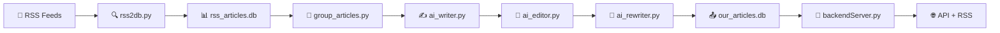

# 🤖 AI Newspaper Backend

> **Next-gen news automation** powered by Gemini AI with intelligent editorial workflow

[](https://python.org)
[](https://fastapi.tiangolo.com)
[](https://ai.google.dev)

## ⚡ Quick Start

```bash
# 🚀 One-command setup
cd /home/onuralp/project/AINewspaper/backend && source venv/bin/activate

# 📰 Complete workflow
python rss2db.py && python group_articles.py && python ai_writer.py --max-articles 10
python ai_editor.py && python ai_rewriter.py && python -m uvicorn backendServer:app --reload --port 8000
```

## 🔥 Core Pipeline

| 🛠️ Script | 🎯 Mission |
|-----------|------------|
| **`rss2db.py`** | 📡 RSS hunter - collects & deduplicates news |
| **`group_articles.py`** | 🧠 Smart grouper - finds related stories |
| **`ai_writer.py`** | ✍️ Gemini writer - creates unified articles |
| **`ai_editor.py`** | 📝 AI editor - 13-metric quality control |
| **`ai_rewriter.py`** | 🔄 Content enhancer - fixes rejected articles |
| **`backendServer.py`** | 🚀 API server - serves news via REST/RSS |

## 🗄️ Data Architecture

### 📥 `rss_articles.db` - Raw News Feed
```sql
articles (id, title, content, image_urls, event_group_id, is_read, ...)
```

### 📤 `our_articles.db` - AI-Generated Content  
```sql
our_articles (id, title, body, category, article_state, editors_note, ...)
```

> **States**: `not_reviewed` → `accepted`/`rejected` → `enhanced`

## 🔄 AI News Pipeline



### 🎯 Pipeline Stages

| Stage | Action | Output |
|-------|--------|--------|
| **📡 Collect** | RSS feeds → database | Raw articles |
| **🧠 Group** | Similarity detection | Event groups |
| **✍️ Write** | Gemini AI generation | Unified articles |
| **📝 Review** | 13-metric evaluation | Quality scores |
| **🔄 Enhance** | AI improvement | Better content |
| **🚀 Serve** | API + RSS delivery | Live news feed |

## 🖼️ Smart Image Processing

| Feature | Description |
|---------|-------------|
| **📡 Multi-Source** | Extracts from RSS, enclosures, media_content |
| **🎯 Quality Sort** | Resolution-based ranking (highest first) |
| **🔍 Smart Filter** | Removes <200×200px images |
| **⭐ Best First** | `images[0]` = highest quality |

## 📊 AI Editorial System

### 🎭 Article States
- **`not_reviewed`** → Fresh from AI writer
- **`accepted`** → Passed quality control ✅
- **`rejected`** → Needs improvement ❌

### 🧠 13-Metric Evaluation
| Category | Metrics |
|----------|---------|
| **📝 Content** | Word count, readability, sentence length |
| **🎯 Structure** | Title relevance, coherence, clarity |
| **✍️ Style** | Active voice, fact density, engagement |

### ⚙️ Config
```python
ONLY_IMAGES = True      # Process only image-rich articles
ARTICLE_COUNT = 2       # Articles per generation run
REVIEW_COUNT = 2        # Articles per review run
MAX_REVIEW_COUNT = 3    # Max enhancement attempts
```

## 🌐 API Endpoints

### 🎯 Frontend API
| Endpoint | Method | Description |
|----------|--------|-------------|
| `/` | GET | 🏠 Server status |
| `/getOneNew` | GET | 📰 Next article (live feed) |
| `/articles` | GET | 📄 Paginated articles |
| `/search` | GET | 🔍 Search articles |
| `/statistics` | GET | 📊 Database stats |

### 📡 RSS Feeds
| Endpoint | Description |
|----------|-------------|
| `/rss` | 📰 Main feed (20 articles) |
| `/rss/latest` | ⚡ Latest 10 articles |
| `/rss/category/{cat}` | 🏷️ By category |
| `/rss/search?q={query}` | 🔍 Search RSS |

### 🏷️ Categories
`gündem` `ekonomi` `spor` `siyaset` `magazin` `yaşam` `eğitim` `sağlık` `astroloji`

## 🧠 AI Editorial Metrics

### 📊 13-Point Quality Assessment

| Category | Metrics | Purpose |
|----------|---------|---------|
| **📝 Content** | Word count, readability, sentence length | Quality & complexity |
| **🎯 Structure** | Title relevance, coherence, clarity | Organization |
| **✍️ Style** | Active voice, fact density, engagement | Writing quality |

> **Decision**: `accepted` ✅ or `rejected` ❌ based on total score

## ⚙️ Setup

```bash
# 🐍 Python 3.11+ required
source venv/bin/activate && pip install -r requirements.txt
```

### 📁 Key Files
| File | Purpose |
|------|---------|
| `rsslist.txt` | 📡 RSS feed URLs |
| `writer_prompt.txt` | ✍️ AI generation prompts |
| `.env` | 🔑 GEMINI_FREE_API key |

## 🎯 Features

| Feature | Status |
|---------|--------|
| **🤖 Gemini AI Integration** | ✅ |
| **📡 Multi-format RSS** | ✅ |
| **🧠 Smart Article Grouping** | ✅ |
| **📝 13-Metric Editorial Review** | ✅ |
| **🔄 AI Content Enhancement** | ✅ |
| **🖼️ Smart Image Processing** | ✅ |
| **🌐 REST + RSS API** | ✅ |
| **🇹🇷 Turkish Language** | ✅ |
| **🔒 Duplicate Prevention** | ✅ |

## 🚨 Quick Fixes

| Issue | Solution |
|-------|----------|
| **No groups** | `--threshold 0.2` |
| **No articles** | `python ai_writer.py --stats` |
| **No reviews** | `python ai_editor.py --stats` |
| **Import errors** | `pip install -r requirements.txt` |

## 🚀 Usage

### 🔥 One-Liner Workflow
```bash
python rss2db.py && python group_articles.py && python ai_writer.py --max-articles 5 && python ai_editor.py && python ai_rewriter.py
```

### 📊 Check Status
```bash
python ai_writer.py --stats    # 📝 Writer stats
python ai_editor.py --stats    # 📊 Editor stats  
python ai_rewriter.py --stats  # 🔄 Rewriter stats
```

### 🌐 API Examples
```bash
curl http://localhost:8000/getOneNew              # 📰 Next article
curl http://localhost:8000/rss                    # 📡 RSS feed
curl http://localhost:8000/search?q=ekonomi       # 🔍 Search
curl http://localhost:8000/rss/category/spor      # 🏷️ Category
```

## 📝 API Response

```json
{
  "news": {
    "id": 2,
    "title": "Article Title",
    "summary": "Brief description", 
    "content": "Full article content",
    "tags": "category, location, keywords",
    "published": "2025-10-08T14:38:00+03:00",
    "image": "https://example.com/image.jpg",
    "images": ["https://example.com/image1.jpg", "..."],
    "link": "https://original-source.com/article"
  }
}
```

## ⏰ Automation

### 🤖 Cron Schedule
```bash
*/30 * * * * python rss2db.py                    # 📡 Every 30min
0 * * * * python group_articles.py               # 🧠 Every hour  
0 */2 * * * * python ai_writer.py --max-articles 3 # ✍️ Every 2hrs
0 */3 * * * * python ai_editor.py                # 📝 Every 3hrs
0 */4 * * * * python ai_rewriter.py              # 🔄 Every 4hrs
```

## 📊 Monitoring

| Metric | Track |
|--------|-------|
| **📡 RSS** | Collection rate, feed success |
| **✍️ Generation** | Output/input ratio, processing time |
| **📝 Editorial** | Acceptance rate, average scores |
| **🗄️ Database** | Size growth, state distribution |

---

> **🚀 Ready to revolutionize news?** Start with `python rss2db.py` and watch the AI magic happen!